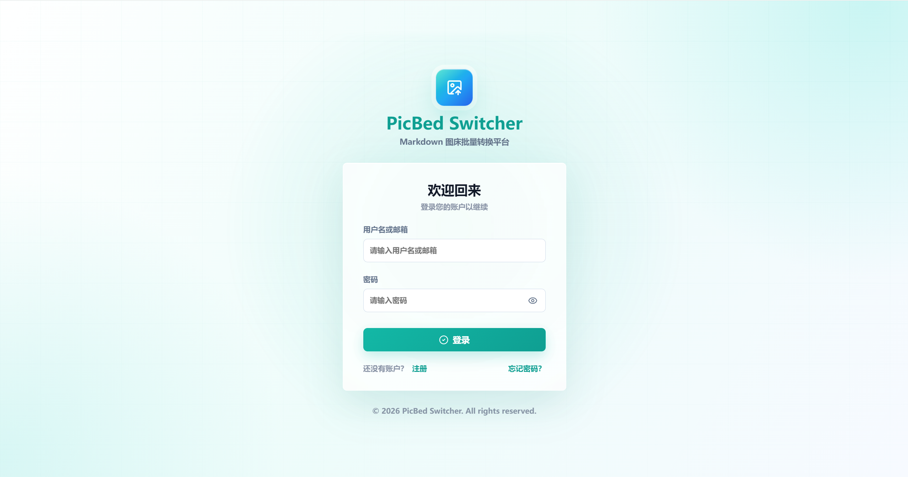
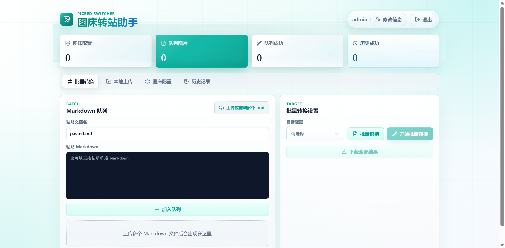

# 图床转站助手 (PicBed Switcher)

一款支持多主流图床的 Markdown 文档图床地址批量转换工具平台。

## 目录

- [一、项目介绍](#一项目介绍)
- [二、本地开发快速启动](#二本地开发快速启动)
- [三、Docker Compose 快速部署（推荐）](#三docker-compose-快速部署推荐)
- [四、生产环境部署](#四生产环境部署)
- [五、API 文档](#五api-文档)
- [六、使用说明](#六使用说明)
- [七、版本历史](#七版本历史)
- [八、安全说明](#八安全说明)
- [九、注意事项](#九注意事项)
- [十、常见问题](#十常见问题)
- [十一、许可证](#十一许可证)
- [十二、致谢](#十二致谢)
- [十三、联系方式](#十三联系方式)

# 一、项目介绍

## 1.1 项目简介

图床转站助手是一款专为解决Markdown文档中图床地址批量转换需求而开发的工具平台。支持GitHub、Gitee、腾讯云COS、阿里云OSS、七牛云、EasyImage等多种图床的适配与切换，提供简洁易用的操作界面，保障用户数据安全。

## 1.2 项目预览

|                     项目登录页                     |
| :------------------------------------------------: |
|  |

|                     项目首页                     |
| :----------------------------------------------: |
|  |

## 1.3 核心功能

- **用户认证**：支持用户注册、登录，基于JWT的会话管理
- **图床配置管理**：支持添加、编辑、删除、查看多种图床配置，敏感信息加密存储
- **Markdown文档处理**：自动识别文档中的图床地址，支持批量转换
- **图床地址转换**：支持多种主流图床之间的相互转换
- **转换历史记录**：记录用户的文档转换历史，支持查看和追溯
- **文档下载**：转换完成后自动生成新文档，支持一键下载

## 1.4 支持的图床

- **GitHub**：基于GitHub仓库的图床服务
- **Gitee**：基于Gitee仓库的图床服务
- **腾讯云COS**：腾讯云对象存储服务
- **阿里云OSS**：阿里云对象存储服务
- **七牛云**：七牛云对象存储服务
- **EasyImage**：自建 EasyImage 图床服务
- **其他图床**：兼容通用上传接口的图床服务

## 1.5 技术栈

### 1.5.1 后端
- **语言**：Go 1.25+
- **框架**：Gin
- **数据库**：PostgreSQL 16+
- **ORM**：GORM
- **认证**：JWT
- **加密**：AES-256-GCM

### 1.5.2 前端
- **框架**：Vue 3
- **构建工具**：Vite
- **语言**：TypeScript
- **UI组件库**：Element Plus
- **状态管理**：Pinia
- **路由**：Vue Router

## 1.6 项目结构

```bash
picbed-switcher/
├── backend/                  # Go 后端服务
│   ├── cmd/                  # 应用入口
│   ├── internal/             # 后端内部模块
│   │   ├── config/           # 环境配置加载
│   │   ├── database/         # 数据库连接与初始化
│   │   ├── handler/          # HTTP 路由与处理器
│   │   ├── middleware/       # 鉴权、CORS、限流等中间件
│   │   ├── model/            # GORM 数据模型
│   │   ├── picbed/           # 图床上传适配器
│   │   └── utils/            # 加密、JWT、Markdown 处理工具
│   ├── migrations/           # PostgreSQL 数据库迁移
│   ├── go.mod
│   ├── go.sum
│   └── .env.example
├── frontend/                 # Vue 3 前端应用
│   ├── public/               # 静态资源
│   ├── src/
│   │   ├── components/       # 页面组件与对话框组件
│   │   ├── composables/      # 业务状态、请求和表单逻辑
│   │   ├── App.vue           # 应用根组件
│   │   ├── main.ts           # 前端入口
│   │   └── style.css         # 全局样式
│   ├── package.json
│   ├── package-lock.json
│   ├── vite.config.ts
│   └── .env.example
├── deploy/                   # Docker 构建与部署配置
│   ├── Dockerfile
│   ├── docker-compose.yml
│   ├── nginx.conf
│   ├── supervisord.conf
│   ├── entrypoint.sh
│   └── .env.example
├── .github/                  # 项目图片等 GitHub 资源
├── .dockerignore
├── .gitignore
├── LICENSE
└── README.md
```

# 二、本地开发快速启动

## 2.1 环境要求

- Go 1.25+
- Node.js 20+
- PostgreSQL 16+

> 如果本地没有安装部署 PostgreSQL，可参考以下docker快速部署相关数据库（可选）。

创建 `pgsql` 指令：

```bash
docker run -d --name pg-prod \
  -p 5432:5432 \
  -v /data/PgSqlData:/var/lib/postgresql/data \
  -e POSTGRES_PASSWORD="123456ok!" \
  -e LANG=C.UTF-8 \
  -e TZ=Asia/Shanghai \
  postgres:17-alpine
```

查看是否创建成功：

```bash
[root@docker-server ~]# docker ps
CONTAINER ID   IMAGE                COMMAND                  CREATED          STATUS          PORTS                                         NAMES
22205f8e78c6   postgres:17-alpine   "docker-entrypoint.s…"   34 minutes ago   Up 34 minutes   0.0.0.0:5432->5432/tcp, [::]:5432->5432/tcp   pg-prod
```

## 3.2 克隆项目

```bash
git clone https://github.com/zyx3721/picbed-switcher.git
cd picbed-switcher
```

## 3.3 数据库配置

### 3.3.1 本地数据库创建

创建 PostgreSQL 数据库：

```bash
psql -Upostgres -c "CREATE DATABASE picbed;"
```

### 3.3.2 容器数据库创建

进入容器内的 psql 交互界面：

```bash
docker exec -it pg-prod psql -U postgres
```

在 psql 中创建 blogdb 库（执行后输入 `\q` 退出）：

```bash
CREATE DATABASE picbed;
```

应用会在首次启动时自动执行 `backend\migrations\001_init_schema.sql` 初始化数据库，包括创建表结构和初始数据。

## 3.4 后端配置与启动

> 如果没有配置go的镜像代理，可以参考 [Go 国内加速：Go 国内加速镜像 | Go 技术论坛](https://learnku.com/go/wikis/38122)。

1. 进入后端目录下载相关依赖：

```bash
cd backend
go mod download
```

2. 配置数据库连接等信息：

```bash
# 步骤1：复制模板文件
cp env.example .env

# 步骤2：编辑 .env，配置数据库连接等信息
vim .env
# 服务器配置
SERVER_HOST=localhost
SERVER_PORT=8080
GIN_MODE=release

# 数据库配置
DB_HOST=postgres
DB_PORT=5432
DB_NAME=picbed
DB_USER=postgres
DB_PASSWORD=your_database_password
DB_SSLMODE=disable

# JWT 配置
JWT_SECRET=your_jwt_secret_key
JWT_EXPIRE_HOURS=24
```

3. 运行后端服务：

```bash
# 方式1：前台运行（终端关闭则服务停止）
go run cmd/main.go

# 方式2：后台运行（日志输出到 app.log）
nohup go run cmd/main.go > app.log 2>&1 &
```

后端服务默认运行在 `http://localhost:8080` ，如需指定地址和端口，请修改环境变量文件内的 `SERVER_HOST` 和 `SERVER_PORT` 参数。首次启动会自动创建数据库和默认管理员账户 `admin / 123456` 。

## 3.5 前端配置与启动

1. 进入前端目录下载相关依赖：

```bash
cd frontend
npm install
```

2. 配置 API 地址（可选）：

```bash
# 配置说明：
# - 后端端口 = 8080：无需创建 .env 文件（默认值为 http://localhost:8080/api/v1）
# - 后端端口 ≠ 8080：需要创建 .env 文件（指定正确端口，例如后端端口改为 8090）
#   创建 .env 文件，例如：
echo "VITE_API_BASE_URL=http://localhost:8080" > .env
```

3. 启动前端服务：

```bash
# 方式1：前台运行（终端关闭则服务停止）
npm run dev

# 方式2：后台运行（日志输出到 admin-frontend.log）
nohup npm run dev > picbed-frontend.log 2>&1 &
```

前端服务默认运行在 `http://localhost:5174/` 。

## 3.6 访问系统

- **首页**：`http://localhost:5174`
  - **默认用户名**：`admin`
  - **默认邮箱**：`admin@example.com`
  - **默认密码**：`123456`

- **API 文档**：`http://localhost:8080/swagger/index.html`

# 三、Docker Compose 快速部署（推荐）

## 3.1 部署目录结构

所有相关文件统一放在 `deploy/` 目录下，单镜像包含前端（Nginx）、后端（blog-backend），通过 supervisord 管理多进程。

```bash
deploy/
├── docker-compose.yml    # 服务编排配置
├── .env                  # 环境变量（需自行创建，见 3.2）
├── .env.example          # 环境变量模板
├── PicBedData/           # 应用持久化数据（首次启动自动创建）
│   └── logs/             # 运行日志
└── PgSqlData/            # PostgreSQL 数据（首次启动自动创建）
```

## 3.2 准备配置文件

进入 `deploy` 目录，创建 `.env` 环境变量文件：

```bash
cd deploy
vim .env
```

`.env` 文件内容参考：

```bash
# 数据库配置
DB_HOST=postgres
DB_PORT=5432
DB_NAME=picbed
DB_USER=postgres
DB_PASSWORD=your_database_password
DB_SSLMODE=disable

# JWT 配置
JWT_SECRET=your_jwt_secret_key
JWT_EXPIRE_HOURS=24
```

## 3.3 构建镜像（可选）

如果不想使用阿里云镜像仓库的镜像，可直接在本地手动构建（默认使用阿里云镜像仓库地址）：

```bash
# 在 deploy/ 目录下构建（构建上下文为项目根目录）
cd deploy
docker build -t picbed-switcher:latest -f Dockerfile ..
```

然后修改 `deploy/docker-compose.yml` 中 `picbed` 服务的 `image` 字段为 `picbed-switcher:latest` 。

## 3.4 启动服务

`docker-compose.yml` 支持两种模式，按需选择：

**模式一：新建 PostgreSQL 容器（默认）**

首次启动会自动创建 `picbed` 数据库：

```bash
cd deploy
docker compose up -d
```

**模式二：使用已有容器**

`.env` 环境变量文件中确保数据库配置填入已有容器地址，并编辑 `deploy/docker-compose.yml`：

1. 注释掉 `postgres` 服务块
2. 注释掉 `picbed.depends_on` 块

```bash
cd deploy
docker compose up -d
```

## 3.5 服务管理

```bash
# 查看服务状态
docker compose ps

# 查看实时日志
docker compose logs -f picbed-switcher

# 重启 blog 服务
docker compose restart picbed-switcher

# 停止所有服务
docker compose down

# 停止并删除数据卷（谨慎！数据会丢失）
docker compose down -v
```

## 3.6 访问系统

服务启动后，访问以下地址：

- **首页**：`http://your-domain.com`
  - **默认用户名**：`admin`
  - **默认邮箱**：`admin@example.com`
  - **默认密码**：`123456`

- **API 文档**：`http://your-domain.com/swagger/index.html`
- **健康检查**：`https://your-domain.com/health`

## 3.7 宿主机 Nginx 反代（可选）

如需通过宿主机 Nginx 配置 HTTPS，将 `deploy/docker-compose.yml` 中的端口映射改为非 80 端口（如 `8080:80`），再配置外部 Nginx 代理：

### 3.7.1 HTTP 示例

```nginx
server {
    listen 80;
    server_name your-domain.com;

    # 限制上传文件大小（可选）
    client_max_body_size 50m;

    # Gzip 压缩配置
    gzip on;
    gzip_vary on;
    gzip_proxied any;
    gzip_comp_level 6;
    gzip_types text/plain text/css text/xml text/javascript
               application/json application/javascript application/xml+rss
               application/rss+xml font/truetype font/opentype
               application/vnd.ms-fontobject image/svg+xml;
    gzip_min_length 1000;

    # 日志配置
    access_log /usr/local/nginx/logs/picbed-access.log;
    error_log /usr/local/nginx/logs/picbed-error.log warn;

    location / {
        proxy_pass http://127.0.0.1:8080;
        proxy_http_version 1.1;
        proxy_set_header Upgrade $http_upgrade;
        proxy_set_header Connection "upgrade";
        proxy_set_header Host $host;
        proxy_set_header X-Real-IP $remote_addr;
        proxy_set_header X-Forwarded-For $proxy_add_x_forwarded_for;
        proxy_set_header X-Forwarded-Proto $scheme;

        # 超时配置
        proxy_connect_timeout 600s;
        proxy_send_timeout 600s;
        proxy_read_timeout 600s;
    }
}
```

### 3.7.2 HTTPS 实例

> HTTPS 示例（含 80→443 跳转，请替换证书路径）：

```nginx
# HTTP 80端口配置，自动重定向到HTTPS
server {
    listen 80;
    server_name your-domain.com;   # 修改为你的域名/主机名，例如：picbed.cn
    return 301 https://$host$request_uri;
}

# blog 站点 HTTPS 配置
server {
    # listen 443 ssl http2;  # Nginx 1.25 以下版本写法
    listen 443 ssl;
    http2 on;
    server_name your-domain.com;   # 修改为你的域名/主机名，例如：picbed.cn

    # 证书路径（替换为实际证书文件）
    ssl_certificate     /usr/local/nginx/ssl/your-domain.com.pem;  # 例如：/usr/local/nginx/ssl/picbed.cn.pem
    ssl_certificate_key /usr/local/nginx/ssl/your-domain.com.key;  # 例如：/usr/local/nginx/ssl/picbed.cn.key

    # SSL安全优化
    ssl_protocols              TLSv1.2 TLSv1.3;
    ssl_prefer_server_ciphers  on;
    ssl_ciphers                ECDHE-RSA-AES128-GCM-SHA256:HIGH:!aNULL:!MD5:!RC4:!DHE;
    ssl_session_timeout        10m;
    ssl_session_cache          shared:SSL:10m;

    # 限制上传文件大小（可选）
    client_max_body_size 50m;

    # Gzip 压缩配置
    gzip on;
    gzip_vary on;
    gzip_proxied any;
    gzip_comp_level 6;
    gzip_types text/plain text/css text/xml text/javascript
               application/json application/javascript application/xml+rss
               application/rss+xml font/truetype font/opentype
               application/vnd.ms-fontobject image/svg+xml;
    gzip_min_length 1000;

    # 日志配置
    access_log /usr/local/nginx/logs/picbed-access.log;
    error_log /usr/local/nginx/logs/picbed-error.log warn;

    location / {
        proxy_pass http://127.0.0.1:8080;
        proxy_http_version 1.1;
        proxy_set_header Upgrade $http_upgrade;
        proxy_set_header Connection "upgrade";
        proxy_set_header Host $host;
        proxy_set_header X-Real-IP $remote_addr;
        proxy_set_header X-Forwarded-For $proxy_add_x_forwarded_for;
        proxy_set_header X-Forwarded-Proto $scheme;

        # 超时配置
        proxy_connect_timeout 600s;
        proxy_send_timeout 600s;
        proxy_read_timeout 600s;
    }
}
```

# 四、生产环境部署

## 4.1 克隆项目

```bash
git clone https://github.com/zyx3721/picbed-switcher.git /data/picbed-switcher
cd /data/picbed-switcher
```

## 4.2 后端构建与配置

1. 进入后端目录下载相关依赖：

```bash
cd backend
go mod download
```

2. 配置数据库连接等信息：

```bash
# 步骤1：复制模板文件
cp env.example .env

# 步骤2：编辑 .env，配置数据库连接等信息
vim .env
# 服务器配置
SERVER_HOST=localhost
SERVER_PORT=8080
GIN_MODE=release

# 数据库配置
DB_HOST=postgres
DB_PORT=5432
DB_NAME=picbed
DB_USER=postgres
DB_PASSWORD=your_database_password
DB_SSLMODE=disable

# JWT 配置
JWT_SECRET=your_jwt_secret_key
JWT_EXPIRE_HOURS=24
```

3. 构建后端可执行文件：

```bash
go build -o picbed-backend cmd/main.go
```

4. 运行后端服务：

```bash
# 方式1：前台运行（终端关闭则服务停止）
./picbed-backend

# 方式2：后台运行（日志输出到 app.log）
nohup ./picbed-backend > app.log 2>&1 &

# 方法3：加入 systemd 管理启动运行
# 服务配置参考如下，请自行修改相应目录路径
cat > /etc/systemd/system/picbed-backend.service <<EOF
[Unit]
Description=Picbed Switcher Backend Golang Service
After=network.target network-online.target
Wants=network-online.target

[Service]
Type=simple
WorkingDirectory=/data/picbed-switcher/backend
ExecStart=/data/picbed-switcher/backend/picbed-backend
Restart=on-failure
RestartSec=5
LimitNOFILE=65535
StandardOutput=journal
StandardError=journal
SyslogIdentifier=picbed-backend

[Install]
WantedBy=multi-user.target
EOF

# 重载服务配置并启动
systemctl daemon-reload
systemctl start picbed-backend

# 设置开机自启
systemctl enable --now picbed-backend
```

## 4.3 前端构建与配置

1. 进入前端目录下载相关依赖：

```bash
cd frontend
npm install
```

2. 构建前端项目：

```
npm run build
```

构建产物在 `dist` 目录，可部署到任何静态服务器（Nginx、Vercel、Netlify 等）。生产环境前端无需配置 API 地址，统一通过 Nginx `/api/` 反向代理到后端。

## 4.4 配置Nginx反向代理

在服务器上准备前端目录（例如 `/data/picbed-swticher/frontend/dist`），**将本地 `dist` 目录中的所有文件和子目录整体上传到该目录**，保持结构不变，例如：

```bash
/data/myBlog/admin/dist/
├── assets/
├── favicon.svg
├── index.html
```

Nginx 中的 `root` 应指向 **包含 `index.html` 的目录本身**（如 `/data/picbed-swticher/frontend/dist` ，可按实际路径调整），而不是上级目录。

### 4.4.1 HTTP 示例

> 配置 Nginx （按需替换域名/路径/证书），`HTTP 示例` ：

```nginx
server {
    listen 80;
    server_name your-domain.com;   # 修改为你的域名/主机名，例如：picbed.cn

    # 前端静态资源目录（dist 构建产物）
    root /data/picbed-swticher/frontend/dist;  # 按实际部署路径修改
    index index.html;

    # 限制上传文件大小（可选）
    client_max_body_size 50m;

    # Gzip 压缩配置
    gzip on;
    gzip_vary on;
    gzip_proxied any;
    gzip_comp_level 6;
    gzip_types text/plain text/css text/xml text/javascript
               application/json application/javascript application/xml+rss
               application/rss+xml font/truetype font/opentype
               application/vnd.ms-fontobject image/svg+xml;
    gzip_min_length 1000;

    # 日志配置
    access_log /usr/local/nginx/logs/picbed-access.log;
    error_log /usr/local/nginx/logs/picbed-error.log warn;

    # 前端路由回退到 index.html（适配前端 history 模式）
    location / {
        try_files $uri $uri/ /index.html;
    }

    # 后端 API 反向代理
    location /api/ {
        proxy_pass http://127.0.0.1:8080;  # 与后端 API 相同地址
        proxy_http_version 1.1;
        proxy_set_header Upgrade $http_upgrade;
        proxy_set_header Connection "upgrade";
        proxy_set_header Host $host;
        proxy_set_header X-Real-IP $remote_addr;
        proxy_set_header X-Forwarded-For $proxy_add_x_forwarded_for;
        proxy_set_header X-Forwarded-Proto $scheme;
        proxy_connect_timeout 60s;
        proxy_send_timeout 300s;
        proxy_read_timeout 300s;
    }

    # 后端 API 文档
    location /swagger/ {
        proxy_pass http://127.0.0.1:8080;  # 与后端 API 相同地址
        proxy_set_header Host $host;
        proxy_set_header X-Real-IP $remote_addr;
        proxy_set_header X-Forwarded-For $proxy_add_x_forwarded_for;
        proxy_set_header X-Forwarded-Proto $scheme;
    }

    # 健康检查
    location = /health {
        proxy_pass http://127.0.0.1:8080/health;
    }
}
```

### 4.4.2 HTTPS 示例

> HTTPS 示例（含 80→443 跳转，请替换证书路径）：

```nginx
# HTTP 80端口配置，自动重定向到HTTPS
server {
    listen 80;
    server_name your-domain.com;   # 修改为你的域名/主机名，例如：picbed.cn
    return 301 https://$host$request_uri;
}

# picbed 站点 HTTPS 配置
server {
    # listen 443 ssl http2;  # Nginx 1.25 以下版本写法
    listen 443 ssl;
    http2 on;
    server_name your-domain.com;   # 修改为你的域名/主机名，例如：picbed.cn

    # 证书路径（替换为实际证书文件）
    ssl_certificate     /usr/local/nginx/ssl/your-domain.com.pem;  # 例如：/usr/local/nginx/ssl/picbed.cn.pem
    ssl_certificate_key /usr/local/nginx/ssl/your-domain.com.key;  # 例如：/usr/local/nginx/ssl/picbed.cn.key

    # SSL安全优化
    ssl_protocols              TLSv1.2 TLSv1.3;
    ssl_prefer_server_ciphers  on;
    ssl_ciphers                ECDHE-RSA-AES256-GCM-SHA512:DHE-RSA-AES256-GCM-SHA512:ECDHE-RSA-AES256-GCM-SHA384:DHE-RSA-AES256-GCM-SHA384;
    ssl_session_timeout        10m;
    ssl_session_cache          shared:SSL:10m;

    # 前端静态资源目录（dist 构建产物）
    root /data/picbed-swticher/frontend/dist;  # 按实际部署路径修改
    index index.html;

    # 限制上传文件大小（可选）
    client_max_body_size 50m;

    # Gzip 压缩配置
    gzip on;
    gzip_vary on;
    gzip_proxied any;
    gzip_comp_level 6;
    gzip_types text/plain text/css text/xml text/javascript
               application/json application/javascript application/xml+rss
               application/rss+xml font/truetype font/opentype
               application/vnd.ms-fontobject image/svg+xml;
    gzip_min_length 1000;

    # 日志配置
    access_log /usr/local/nginx/logs/picbed-access.log;
    error_log /usr/local/nginx/logs/picbed-error.log warn;

    # 前端路由回退到 index.html（适配前端 history 模式）
    location / {
        try_files $uri $uri/ /index.html;
    }

    # 后端 API 反向代理
    location /api/ {
        proxy_pass http://127.0.0.1:8080;  # 与后端 API 相同地址
        proxy_http_version 1.1;
        proxy_set_header Upgrade $http_upgrade;
        proxy_set_header Connection "upgrade";
        proxy_set_header Host $host;
        proxy_set_header X-Real-IP $remote_addr;
        proxy_set_header X-Forwarded-For $proxy_add_x_forwarded_for;
        proxy_set_header X-Forwarded-Proto $scheme;
        proxy_connect_timeout 60s;
        proxy_send_timeout 300s;
        proxy_read_timeout 300s;
    }

    # 后端 API 文档
    location /swagger/ {
        proxy_pass http://127.0.0.1:8080;  # 与后端 API 相同地址
        proxy_set_header Host $host;
        proxy_set_header X-Real-IP $remote_addr;
        proxy_set_header X-Forwarded-For $proxy_add_x_forwarded_for;
        proxy_set_header X-Forwarded-Proto $scheme;
    }

    # 健康检查
    location = /health {
        proxy_pass http://127.0.0.1:8080/health;
    }
}
```

## 4.5 访问系统

服务启动后，访问以下地址：

- **首页**：`http://your-domain.com`
  - **默认用户名**：`admin`
  - **默认邮箱**：`admin@example.com`
  - **默认密码**：`123456`

- **API 文档**：`http://your-domain.com/swagger/index.html`
- **健康检查**：`https://your-domain.com/health`

# 五、API文档

## 5.1 认证接口

- `POST /api/auth/register` - 用户注册
- `POST /api/auth/login` - 用户登录
- `GET /api/auth/profile` - 获取用户信息
- `PUT /api/auth/password` - 修改当前用户密码
- `PUT /api/auth/email` - 修改当前用户邮箱

## 5.2 图床配置接口

- `GET /api/picbed/types` - 获取支持的图床类型与配置字段
- `POST /api/picbed/configs` - 添加图床配置
- `GET /api/picbed/configs` - 获取所有配置
- `PUT /api/picbed/configs/:id` - 更新配置
- `DELETE /api/picbed/configs/:id` - 删除配置
- `PUT /api/picbed/configs/:id/default` - 设置为默认配置

## 5.3 文档转换接口

- `POST /api/convert/analyze` - 分析 Markdown 文档中的图片地址
- `POST /api/convert/process` - 执行单个 Markdown 文档转换
- `POST /api/convert/batch` - 批量执行 Markdown 文档转换
- `GET /api/convert/records` - 获取转换历史

## 5.4 基础接口

- `GET /health` - 服务健康检查

> 以上接口除注册、登录和健康检查外，均需要在请求头中携带 `Authorization: Bearer <token>`。

# 六、使用说明

## 6.1 注册/登录

首次使用可使用默认账号或注册新账号，已有账号可直接登录。

## 6.2 配置图床

在"图床配置"页面添加您使用的图床配置信息：

- **GitHub**：需要提供Personal Access Token、仓库信息
- **Gitee**：需要提供Private Token、仓库信息
- **腾讯云COS**：需要提供SecretId、SecretKey、存储桶信息
- **阿里云OSS**：需要提供AccessKeyId、AccessKeySecret、存储桶信息
- **七牛云**：需要提供AccessKey、SecretKey、存储桶信息
- **EasyImage**：需要提供 API 地址和 Token
- **其他图床**：需要提供兼容上传接口的 API 地址、Token 等信息

## 6.3 转换文档

1. 在"文档转换"页面上传Markdown文档
2. 系统自动识别文档中的图床类型
3. 选择目标图床（从已配置的图床中选择）
4. 点击"开始转换"按钮
5. 等待转换完成
6. 下载转换后的文档

## 6.4 查看历史

在"转换历史"页面可以查看所有转换记录，包括转换时间、源图床、目标图床、转换状态等信息。

# 七、版本历史

## v1.0.0 - 2026-05-18

- 首个正式版本，完成图床转站助手核心功能闭环。
- 支持用户认证、图床配置管理、Markdown 图片地址分析、单文档转换、批量转换和转换历史记录。
- 支持 GitHub、Gitee、腾讯云 COS、阿里云 OSS、七牛云、EasyImage 和兼容通用接口的图床服务。
- 提供 Vue 3 前端工作台、Go/Gin 后端 API、PostgreSQL 数据库初始化、Docker Compose 部署配置和 Swagger 接口文档。
- 详细更新日志见 [verchanglog/v1.0.0.md](verchanglog/v1.0.0.md)。

# 八、安全说明

- 图床 Token、密钥等配置采用 AES-256-GCM 加密存储
- 用户密码使用 bcrypt 单向哈希存储
- 接口采用JWT认证，防止未授权访问
- 接口配置了速率限制，防止高频恶意请求
- 前端展示敏感信息时进行脱敏处理

# 九、注意事项

1. **API限制**：部分图床（如GitHub）有API速率限制，请合理使用
2. **文件大小**：建议单个Markdown文档不超过10MB
3. **图片格式**：不同图床对图片格式要求不同，转换时请注意兼容性
4. **数据备份**：建议定期备份PostgreSQL数据库
5. **密钥安全**：请妥善保管 JWT_SECRET，生产环境不要使用示例值

# 十、常见问题

## Q: 转换失败怎么办？

A: 请检查：
1. 图床配置是否正确
2. Token/密钥是否有效
3. 网络连接是否正常
4. 图床API是否有速率限制

## Q: 如何备份数据？

A: 使用以下命令备份PostgreSQL数据库：

```bash
docker exec picbed-postgres pg_dump -U your_user picbed_switcher > backup.sql
```

## Q: 如何恢复数据？

A: 使用以下命令恢复数据库：

```bash
docker exec -i picbed-postgres psql -U your_user picbed_switcher < backup.sql
```

# 十一、许可证

本项目采用 [MIT License](LICENSE) 开源协议。

MIT License 是一个宽松的开源许可证,允许您自由地使用、复制、修改、合并、发布、分发、再许可和/或销售本软件的副本。唯一的要求是在所有副本或重要部分中保留版权声明和许可声明。

# 十二、致谢

感谢以下开源项目和技术社区的支持:

- [Gin](https://github.com/gin-gonic/gin) - 高性能的 Go Web 框架
- [GORM](https://gorm.io/) - Go ORM 框架
- [PostgreSQL](https://www.postgresql.org/) - 稳定可靠的开源关系型数据库
- [Vue](https://vuejs.org/) - 渐进式 JavaScript 框架
- [Vite](https://vite.dev/) - 快速前端构建工具
- [Lucide](https://lucide.dev/) - 简洁一致的开源图标库
- [MinIO Go Client](https://github.com/minio/minio-go) - S3 兼容对象存储客户端
- [EasyImage](https://github.com/icret/EasyImages2.0) - 简单易用的自建图床方案

特别感谢所有为本项目贡献代码、提出建议和报告问题的开发者。

# 十三、联系方式

如果您在使用过程中遇到问题,或有任何建议和反馈,欢迎通过以下方式联系:

- **Email**: 416685476@qq.com
- **GitHub Issues**: [https://github.com/zyx3721/picbed-switcher/issues](https://github.com/zyx3721/picbed-switcher/issues)
- **项目主页**: [https://github.com/zyx3721/picbed-switcher](https://github.com/zyx3721/picbed-switcher)

---

**⭐ 如果这个项目对您有帮助,欢迎 Star 支持!**
