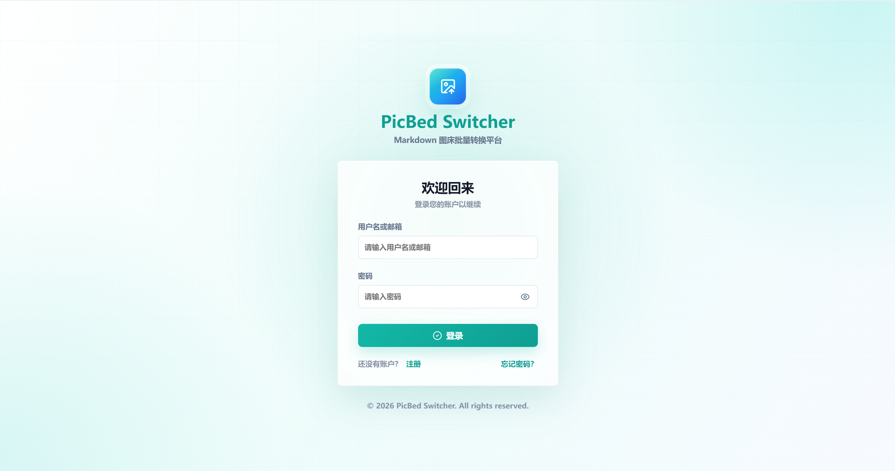
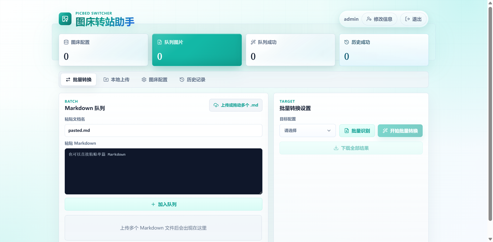

<div align="center">

<h1>PicBed Switcher</h1>

<p><b>图床转站助手</b> — GitHub · Gitee · 腾讯云 COS · 阿里云 OSS · 七牛云 · 百度云 BOS · 华为云 OBS · 又拍云 · MinIO · EasyImage</p>

<p><b>简体中文</b> · <a href="README.en.md">English</a></p>

Markdown 文档里的图床地址，换图床、换仓库、换域名时要逐篇逐链接手改。  
PicBed Switcher 把它们收进一套**自托管**的批量转换平台：Go 后端 + Vue 3 控制台 + PostgreSQL。  
一份 `docker compose up -d`，或一个从 Release 下载的二进制，就能跑起来。  
文档、转换历史与图床密钥都落在你自己的数据库与磁盘上；密钥以 AES-256-GCM 加密存储。

<p>
  <a href="LICENSE"></a>
  <a href="https://go.dev/"></a>
  <a href="https://vuejs.org/"></a>
  <a href="https://www.postgresql.org/"></a>
</p>

<p>
  <b><a href="#项目预览">项目预览</a></b> ·
  <a href="#它做什么">它做什么</a> ·
  <a href="#怎么工作">怎么工作</a> ·
  <a href="#技术栈">技术栈</a> ·
  <a href="#快速开始">快速开始</a> ·
  <a href="#部署">部署</a> ·
  <a href="#支持的图床">图床</a> ·
  <a href="#数据与安全">安全</a> ·
  <a href="#api-文档">API</a> ·
  <a href="#常见问题">常见问题</a> ·
  <a href="#项目结构">项目结构</a> ·
  <a href="#文档">文档</a>
</p>

</div>

---

## 项目预览

### 登录

| 项目登录页 |
| :---: |
|  |

### 工作台

| 项目首页 |
| :---: |
|  |

## 它做什么

- **多图床适配** — 支持 GitHub、Gitee、腾讯云 COS、阿里云 OSS、七牛云、百度云 BOS、华为云 OBS、又拍云、MinIO 与 EasyImage 十类图床，以及兼容通用上传接口的自建服务。
- **文档转换** — 上传 Markdown 文档后自动识别其中的图床地址与类型，从已配置的图床中选择目标，一键批量转换并生成新文档下载。
- **本地上传** — 识别 Markdown 中的本地图片引用（相对路径、绝对路径、`` 标签），把图片上传到目标图床后自动替换为远程地址。
- **转换任务队列** — 批量转换与本地上传都会创建持久化任务；开启 Redis 后由后台 worker 按并发数消费，刷新页面后可按任务 ID 继续查看进度，未开启时回退为本进程内存队列。
- **文件命名格式** — 上传对象路径支持 `{y}`、`{m}`、`{d}`、`{hash}`、`{rand:N}` 等变量组合，按日期目录、内容哈希或自定义模板命名。
- **图床配置管理** — 添加、编辑、删除、测试多种图床配置，支持设置默认图床；敏感信息加密存储，前端展示脱敏。
- **转换历史** — 记录每次转换的源/目标图床、状态与图片数量，支持批量删除，详情中可查看每张图片的替换明细并下载转换结果。
- **用户认证** — 注册、登录、邮箱验证、密码找回邮件流程与 JWT 会话管理。

**它不是**图床本身，也不是图片压缩或 CDN 管理工具：PicBed Switcher 管的是「文档里图片地址的批量迁移与替换」，不代理图片流量，不缓存图片，不修改原图。

同一个换图床场景，放在两种做法里大致是这样：

| 现场 | 手工替换 | 用 PicBed Switcher |
| --- | --- | --- |
| 换图床 | 逐篇文档逐个链接手改 | 选好目标图床，批量转换一次完成 |
| 换仓库/换域名 | 查找替换容易漏、易错 | 自动识别图床类型与地址，精准替换 |
| 本地图片 | 先手动上传再逐个改链接 | 本地上传后自动替换为远程地址 |
| 转换进度 | 改到一半不知道到哪了 | 任务队列持久化，刷新后继续看进度 |
| 转换记录 | 无据可查 | 历史记录保留每次替换明细 |
| 图床密钥 | 散落在各处脚本里 | AES-256-GCM 加密存储在数据库 |

## 怎么工作

```text
        浏览器
           │  http
           ▼
  ┌──────────────────────────────────────┐
  │  Nginx（容器内或宿主机）                │
  │  /                  → 前端静态资源     │
  │  /api/ · /swagger/  → Go 后端          │
  └──────────────────────────────────────┘
        │                        │
        ▼                        ▼
  Vue 3 控制台              Go 1.25 后端
  Vite 静态产物             Gin :8080
                                 │
                    ┌────────────┼────────────┐
                    ▼            ▼            ▼
              PostgreSQL    图床上传适配器   转换任务队列
              用户/配置/历史  GitHub·COS·OSS… Redis（可选）
```

- **谁负责什么** — 控制台负责上传文档、选择图床、展示任务进度与转换结果；文档解析、地址识别、图片上传与替换、任务调度全部由后端执行。
- **数据放哪** — PostgreSQL 是业务数据的事实来源，保存用户、图床配置、转换任务与历史记录；图床密钥以 AES-256-GCM 加密落库。
- **任务队列** — Redis 开启时转换任务写入 Redis List 由后台 worker 消费；未开启时回退为本进程内存队列，服务启动时会自动重新入队仍处于排队状态的任务。
- **对外暴露** — 注册、登录、邮箱验证、密码找回与健康检查接口可匿名访问，其余接口一律要求 `Authorization: Bearer <token>`。

## 技术栈

| 层 | 选型 |
| --- | --- |
| 后端语言 | Go 1.25+ |
| HTTP 框架 | [Gin](https://github.com/gin-gonic/gin) |
| 数据库 | PostgreSQL 16+（[GORM](https://gorm.io/)） |
| 任务队列 | Redis 5.0+（可选，未开启时回退为本进程内存队列） |
| 认证与加密 | JWT、bcrypt 口令散列、AES-256-GCM 敏感配置加密 |
| API 文档 | [swag](https://github.com/swaggo/swag) + Swagger UI |
| 前端框架 | Vue 3 + TypeScript |
| 构建工具 | [Vite](https://vite.dev/) |
| UI 与状态 | Element Plus、Pinia、Vue Router、Lucide |
| 对象存储客户端 | [MinIO Go Client](https://github.com/minio/minio-go)（S3 兼容） |
| 运行时打包 | Docker（Nginx + Supervisor 多进程） |

## 快速开始

本地开发需要 **Go 1.25+**、**Node.js 20+** 与 **PostgreSQL 16+**。

```bash
git clone https://github.com/zyx3721/picbed-switcher.git
cd picbed-switcher
```

**后端**

```bash
cd backend
go mod download
cp .env.example .env       # 按需修改数据库连接与密钥
go run cmd/main.go
```

后端默认运行在 `http://localhost:8080`，首次启动会自动执行数据库迁移并创建默认管理员 `admin / 123456`（**登录后请立刻改密码**）。

**前端**（另开一个终端）

```bash
cd frontend
npm install
npm run dev
```

前端默认运行在 `http://localhost:5173`。后端端口不是 8080 时，创建 `frontend/.env` 写入 `VITE_API_BASE_URL=http://localhost:<后端端口>`。

打开 `http://localhost:5173` 登录使用，Swagger 在 `http://localhost:8080/swagger/index.html`。

## 部署

只保留两种方式：**Docker Compose 部署**（推荐）与 **Release 二进制部署**。源码编译、宿主机 Nginx 反代与 HTTPS 的完整过程见 [《完整手册》](docs/manual.md)。

### 方式一：Docker Compose 部署

镜像内置 Go 后端、Nginx 与前端静态资源，由 Supervisor 管理多进程，对外只暴露 80 端口，同时附带 PostgreSQL 容器：

```bash
cd deploy
cp .env.example .env
vim .env                   # 至少修改 DB_PASSWORD 与 JWT_SECRET
docker compose up -d
```

服务管理：

```bash
docker compose ps                       # 查看服务状态
docker compose logs -f picbed-switcher  # 查看实时日志
docker compose restart picbed-switcher  # 重启服务
docker compose down                     # 停止所有服务
```

**访问**

- 控制台：`http://your-domain.com`，默认账号 `admin / 123456`
- 接口文档：`http://your-domain.com/swagger/index.html`
- 健康检查：`http://your-domain.com/health`

需要域名、HTTPS 或使用已有 PostgreSQL 时，完整示例见 [《完整手册》第三章](docs/manual.md)。

### 方式二：Release 二进制部署

前往 [GitHub Releases](https://github.com/zyx3721/picbed-switcher/releases) 页面，按自己的操作系统与 CPU 架构下载对应压缩包，再按下面步骤校验、解压、配置、启动。二进制部署需要自行准备 PostgreSQL 16+ 数据库。

**下载哪个包**

| 你的机器 | 下载文件 |
| --- | --- |
| Linux x86_64 | `picbed-switcher_<版本>_linux_amd64.tar.gz` |
| Linux ARM64（鲲鹏、飞腾等） | `picbed-switcher_<版本>_linux_arm64.tar.gz` |
| macOS Intel 芯片 | `picbed-switcher_<版本>_darwin_amd64.tar.gz` |
| macOS Apple 芯片 | `picbed-switcher_<版本>_darwin_arm64.tar.gz` |
| Windows x86_64 | `picbed-switcher_<版本>_windows_amd64.zip` |
| Windows ARM64 | `picbed-switcher_<版本>_windows_arm64.zip` |
| 前端界面（以上任意平台都需要） | `picbed-switcher-frontend_<版本>.tar.gz` |
| 校验和 | `picbed-switcher_<版本>_checksums.txt` |

后端包内是 `picbed-switcher` 可执行文件（Windows 为 `picbed-switcher.exe`）、`.env.example` 与 `README.txt`；前端包内是 Vite 构建的静态资源，部署到 Nginx 等任意静态服务器即可。

**1. 校验并解压**

```bash
VERSION=3.0.1
mkdir -p /data/picbed-switcher && cd /data/picbed-switcher
sha256sum -c picbed-switcher_${VERSION}_checksums.txt
mkdir -p backend frontend
tar -xzf picbed-switcher_${VERSION}_linux_amd64.tar.gz -C backend --strip-components=1
tar -xzf picbed-switcher-frontend_${VERSION}.tar.gz -C frontend
```

**2. 配置并启动后端**

```bash
cd /data/picbed-switcher/backend
cp .env.example .env
vim .env                   # 配置数据库连接、JWT_SECRET 与 SMTP 邮件
./picbed-switcher
```

后端默认监听 `http://localhost:8080`，首次启动会自动执行数据库迁移并创建默认管理员。

后端同时支持命令行参数，显式传入的参数优先于环境变量与 `.env` 文件；`./picbed-switcher -v` 可查看版本信息（版本、commit、构建时间），`./picbed-switcher -h` 查看全部参数：

| 参数 | 等价环境变量 | 说明 |
| --- | --- | --- |
| `-host` | `SERVER_HOST` | 后端监听主机 |
| `-port` | `SERVER_PORT` | 后端监听端口 |
| `-mode` | `GIN_MODE` | Gin 运行模式（debug/release/test） |
| `-db-host` | `DB_HOST` | 数据库主机 |
| `-db-port` | `DB_PORT` | 数据库端口 |
| `-db-name` | `DB_NAME` | 数据库名称 |
| `-db-user` | `DB_USER` | 数据库用户 |
| `-db-password` | `DB_PASSWORD` | 数据库密码 |
| `-db-sslmode` | `DB_SSLMODE` | 数据库 SSL 模式 |
| `-jwt-secret` | `JWT_SECRET` | JWT 签名密钥 |
| `-env` | 无 | 指定 `.env` 配置文件路径 |
| `-v`、`-version` | 无 | 显示版本信息并退出 |

需要常驻时交给 systemd：

```ini
# /etc/systemd/system/picbed-backend.service
[Unit]
Description=PicBed Switcher Backend
After=network.target network-online.target
Wants=network-online.target

[Service]
Type=simple
WorkingDirectory=/data/picbed-switcher/backend
ExecStart=/data/picbed-switcher/backend/picbed-switcher
Restart=on-failure
RestartSec=5
LimitNOFILE=65535

[Install]
WantedBy=multi-user.target
```

```bash
systemctl daemon-reload && systemctl enable --now picbed-backend
```

**3. 部署前端并收口**

把 `frontend/` 目录部署为 Nginx 静态根目录，`/api/` 反向代理到后端：

```nginx
server {
    listen 80;
    server_name your-domain.com;
    client_max_body_size 50m;

    location / {
        root /data/picbed-switcher/frontend;
        try_files $uri $uri/ /index.html;
    }

    location /api/ {
        proxy_pass http://127.0.0.1:8080;
        proxy_set_header Host $host;
        proxy_set_header X-Real-IP $remote_addr;
        proxy_set_header X-Forwarded-For $proxy_add_x_forwarded_for;
        proxy_set_header X-Forwarded-Proto $scheme;
        proxy_read_timeout 300s;
    }

    location /swagger/ {
        proxy_pass http://127.0.0.1:8080;
        proxy_set_header Host $host;
    }

    location = /health {
        proxy_pass http://127.0.0.1:8080/health;
    }
}
```

含 HTTPS 与 80→443 跳转的完整示例见 [《完整手册》第四章](docs/manual.md)。

**4. 访问**

同 Docker 方式：控制台 `http://your-domain.com`（`admin / 123456`）、接口文档 `/swagger/index.html`、健康检查 `/health`。

## 支持的图床

| 图床 | 所需配置 |
| --- | --- |
| GitHub | Personal Access Token、仓库信息 |
| Gitee | Private Token、仓库信息 |
| 腾讯云 COS | SecretId、SecretKey、存储桶 |
| 阿里云 OSS | AccessKeyId、AccessKeySecret、存储桶 |
| 七牛云 | AccessKey、SecretKey、存储桶 |
| 百度云 BOS | AccessKeyId、SecretAccessKey、存储桶、地域 |
| 华为云 OBS | AccessKeyId、SecretAccessKey、存储桶、地域 |
| 又拍云 | 服务名、操作员、密码、加速域名 |
| MinIO | Endpoint、AccessKey、SecretKey、存储桶（可选地域、SSL、公开访问域名） |
| EasyImage | API 地址、Token |
| 其他图床 | 兼容上传接口的 API 地址、Token |

除 EasyImage 外均支持自定义「文件命名格式」，可用变量与示例见 [《完整手册》6.2.1 节](docs/manual.md)。

## 数据与安全

```text
控制台账号登录、管配置、转文档
        +
Bearer Token 逐接口校验，匿名接口仅限注册登录与找回密码流程
        +
图床 Token / 密钥 AES-256-GCM 加密落库，前端展示脱敏
        +
密码 bcrypt 单向哈希，接口配置速率限制
```

- **先改默认密码** — 首次部署后立即修改 `admin` 的默认口令。
- **更换 JWT 密钥** — 生产环境务必将 `JWT_SECRET` 设置为足够随机的长字符串，不要使用示例值；重设后全部已签发令牌失效。
- **启用 HTTPS** — 生产环境通过 Nginx 配置证书，参考 [《完整手册》4.4.2 节](docs/manual.md)。
- **定期备份数据库** — PostgreSQL 保存全部业务数据，建议定期 `pg_dump` 备份。

## API 文档

后端集成 Swagger/OpenAPI，启动后即可查看在线接口文档：

- **Swagger UI**：`http://localhost:8080/swagger/index.html`
- **健康检查**：`GET /health`

无需认证的接口只有：注册、登录、邮箱验证、密码找回/重置和健康检查；其余接口均需在请求头携带 `Authorization: Bearer <token>`。

按模块分组的完整接口清单（认证、图床配置、文档转换）见 [《完整手册》第五章](docs/manual.md)。

修改接口后，在 `backend/` 目录执行以下命令同步 Swagger 产物：

```bash
swag init -g cmd/main.go -o docs
```

## 常见问题

**转换失败怎么办？**

按顺序检查：图床配置是否正确、Token/密钥是否有效、网络连接是否正常、图床 API 是否触发速率限制；转换历史详情中的错误摘要会给出具体原因。

**如何备份数据？**

```bash
docker exec picbed-postgres pg_dump -U your_user picbed_switcher > backup.sql
```

**如何恢复数据？**

```bash
docker exec -i picbed-postgres psql -U your_user picbed_switcher < backup.sql
```

**本地上传支持哪些图片引用？**

支持相对路径（`./images/a.png`、`images/a.png`）、Windows 绝对路径与 `` 标签；`http://`、`https://` 远程地址会保持不变，如需转换远程地址请使用文档转换。其余问题见 [《完整手册》](docs/manual.md)。

## 项目结构

```text
picbed-switcher/
├── backend/                 Go 后端服务
│   ├── cmd/                 应用入口
│   ├── internal/            后端内部模块
│   │   ├── buildinfo/       构建版本信息（-ldflags 注入）
│   │   ├── config/          环境配置加载
│   │   ├── database/        数据库连接与初始化
│   │   ├── handler/         HTTP 路由与处理器
│   │   ├── middleware/      鉴权、CORS、限流等中间件
│   │   ├── model/           GORM 数据模型
│   │   ├── picbed/          图床上传适配器
│   │   └── utils/           加密、JWT、Markdown 处理工具
│   ├── migrations/          PostgreSQL 数据库迁移
│   ├── docs/                Swagger 生成产物
│   └── .env.example         环境变量模板
├── frontend/                Vue 3 前端应用
│   ├── public/              静态资源
│   ├── src/
│   │   ├── components/      页面组件与对话框组件
│   │   ├── composables/     业务状态、请求和表单逻辑
│   │   │   └── workspace/   工作台内图床配置、转换、本地上传等业务逻辑
│   │   ├── App.vue          应用根组件
│   │   ├── main.ts          前端入口
│   │   └── style.css        全局样式
│   └── .env.example         前端环境变量模板
├── deploy/                  Docker 构建与部署配置
│   ├── Dockerfile
│   ├── docker-compose.yml
│   ├── nginx.conf
│   ├── supervisord.conf
│   ├── entrypoint.sh
│   └── .env.example
├── docs/                    完整手册
│   └── manual.md
├── verchanglog/             版本更新日志
├── .github/                 GitHub Actions 工作流与预览图
├── LICENSE
├── README.md                中文说明（本文件）
└── README.en.md             English
```

## 文档

| 先看这个 | 再往下 |
| --- | --- |
| [快速开始](#快速开始) | 本地起后端与前端，默认账号与端口 |
| [部署](#部署) | Docker Compose 与 Release 二进制两条路径 |
| [完整手册](docs/manual.md) | 本地开发、部署细节、Nginx 与 HTTPS 示例、API 清单、使用说明 |
| [English README](README.en.md) | 同样的内容，英文版 |

## 版本历史

| 版本 | 发布日期 | 更新日志 |
| --- | --- | --- |
| v3.0.1 | 2026-05-19 | [verchanglog/v3.0.1.md](verchanglog/v3.0.1.md) |
| v3.0.0 | 2026-05-19 | [verchanglog/v3.0.0.md](verchanglog/v3.0.0.md) |
| v2.1.0 | 2026-05-18 | [verchanglog/v2.1.0.md](verchanglog/v2.1.0.md) |
| v2.0.0 | 2026-05-18 | [verchanglog/v2.0.0.md](verchanglog/v2.0.0.md) |
| v1.0.0 | 2026-05-18 | [verchanglog/v1.0.0.md](verchanglog/v1.0.0.md) |

各版本的构建产物与发布说明见 [GitHub Releases](https://github.com/zyx3721/picbed-switcher/releases)。

## 致谢

感谢以下开源项目和技术社区的支持：

- [Gin](https://github.com/gin-gonic/gin) — 高性能的 Go Web 框架
- [GORM](https://gorm.io/) — Go ORM 框架
- [PostgreSQL](https://www.postgresql.org/) — 稳定可靠的开源关系型数据库
- [Vue](https://vuejs.org/) — 渐进式 JavaScript 框架
- [Vite](https://vite.dev/) — 快速前端构建工具
- [Element Plus](https://element-plus.org/) — Vue 3 组件库
- [Lucide](https://lucide.dev/) — 简洁一致的开源图标库
- [MinIO Go Client](https://github.com/minio/minio-go) — S3 兼容对象存储客户端
- [EasyImage](https://github.com/icret/EasyImages2.0) — 简单易用的自建图床方案

也感谢所有为本项目贡献代码、提出建议和报告问题的开发者。

## 许可证

本项目采用 [MIT License](LICENSE) 开源协议，可自由使用、复制、修改、合并、发布、分发、再许可与销售，只需在所有副本或重要部分中保留版权声明与许可声明。

## 联系方式

- **Email**：416685476@qq.com
- **GitHub Issues**：[zyx3721/picbed-switcher/issues](https://github.com/zyx3721/picbed-switcher/issues)
- **项目主页**：[github.com/zyx3721/picbed-switcher](https://github.com/zyx3721/picbed-switcher)

---

**⭐ 如果这个项目对您有帮助，欢迎 Star 支持！**
